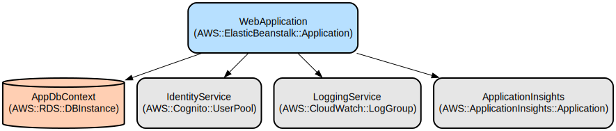

# Blood Donation Management System: Streamline Blood Donation Operations and Inventory Management

The Blood Donation Management System is a comprehensive web application that helps healthcare organizations efficiently manage blood donations, donor information, appointments, and inventory tracking. Built with ASP.NET Core, it provides a secure and user-friendly platform for managing the complete blood donation lifecycle.

The system enables organizations to maintain detailed donor records, schedule and track donation appointments, manage blood inventory levels, and communicate effectively with donors. It features robust security measures, data validation, and monitoring capabilities to ensure reliable operation and data integrity.

## Repository Structure
```
.
├── Data/                      # Database context and data access layer
│   └── AppDbContext.cs       # Entity Framework DbContext configuration
├── Models/                    # Domain model classes
│   ├── Appointment.cs        # Appointment scheduling model
│   ├── BloodInventory.cs     # Blood inventory tracking model
│   ├── Donor.cs             # Donor information model
│   ├── DonorCommunication.cs # Donor communication records
│   └── User.cs              # User authentication model
├── Pages/                    # Razor Pages for the UI
│   ├── Appointments/        # Appointment management views
│   ├── BloodInventories/    # Inventory management views
│   ├── DonorCommunications/ # Communication management views
│   └── Donors/             # Donor management views
├── wwwroot/                 # Static files (CSS, JavaScript, libraries)
├── Program.cs              # Application entry point and configuration
└── appsettings.json       # Application configuration settings
```

## Usage Instructions
### Prerequisites
- .NET 6.0 SDK or later
- SQL Server 2019 or later
- Visual Studio 2022 or VS Code with C# extensions
- Node.js (for client-side library management)

### Installation

1. Clone the repository:
```bash
git clone <repository-url>
cd BloodDonationManagementSystem
```

2. Restore dependencies:
```bash
dotnet restore
```

3. Update database connection string in appsettings.json:
```json
{
  "ConnectionStrings": {
    "DefaultConnection": "Server=<server>;Database=BloodDonationManagementSystem;Trusted_Connection=True;MultipleActiveResultSets=true"
  }
}
```

4. Apply database migrations:
```bash
dotnet ef database update
```

5. Run the application:
```bash
dotnet run
```

### Quick Start
1. Access the application at `https://localhost:7007` or `http://localhost:5174`
2. Log in with administrator credentials
3. Navigate to Donors section to add new donors
4. Schedule appointments through the Appointments section
5. Track blood inventory in the Blood Inventories section

### More Detailed Examples

**Adding a New Donor:**
```csharp
var donor = new Donor
{
    FirstName = "John",
    LastName = "Doe",
    BloodType = "A+",
    Email = "john.doe@example.com",
    ContactNumber = "1234567890"
};
```

**Scheduling an Appointment:**
```csharp
var appointment = new Appointment
{
    DonorID = donorId,
    AppointmentDate = DateTime.Now.AddDays(7),
    Status = "Scheduled"
};
```

### Troubleshooting

Common Issues:
1. Database Connection Errors
   - Verify connection string in appsettings.json
   - Ensure SQL Server is running
   - Check database permissions

2. Authentication Issues
   - Clear browser cookies
   - Verify user credentials
   - Check Identity configuration in Program.cs

Debug Logging:
- Logs are stored in the "Logs" directory
- Enable detailed logging in appsettings.json:
```json
{
  "Logging": {
    "LogLevel": {
      "Default": "Debug"
    }
  }
}
```

## Data Flow
The system follows a standard MVC/Razor Pages pattern for data processing.

```ascii
[Client Browser] <-> [Razor Pages] <-> [Models/Controllers] <-> [Entity Framework] <-> [SQL Server]
     ^                    ^                   ^                         ^
     |                    |                   |                         |
     +--------------------+-------------------+-------------------------+
              Security & Authentication Layer
```

Key Component Interactions:
1. Client requests are handled by Razor Pages
2. Data validation occurs at both client and server levels
3. Entity Framework Core manages database operations
4. Authentication middleware secures all operations
5. Serilog handles logging across components
6. Application Insights provides monitoring

## Infrastructure


The application uses the following Azure resources:

**Database:**
- SQL Server instance for data storage
- Entity Framework Core for data access

**Security:**
- ASP.NET Core Identity for authentication
- Secure headers middleware
- HTTPS enforcement

**Monitoring:**
- Application Insights for telemetry
- Serilog for structured logging
- Custom error handling middleware

**Performance:**
- Response caching
- Static file caching
- Database connection pooling